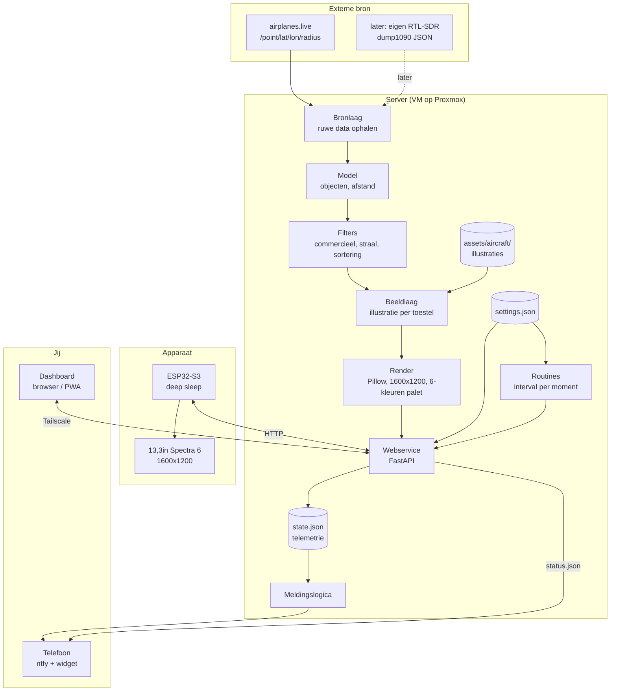
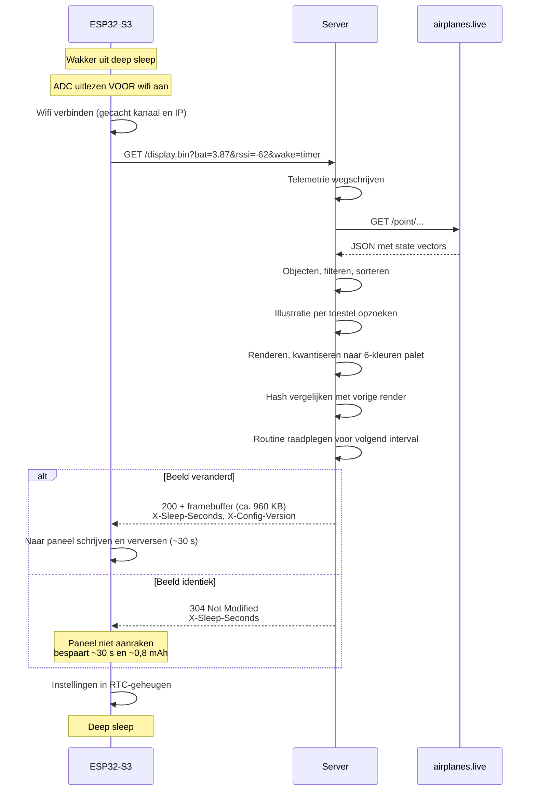
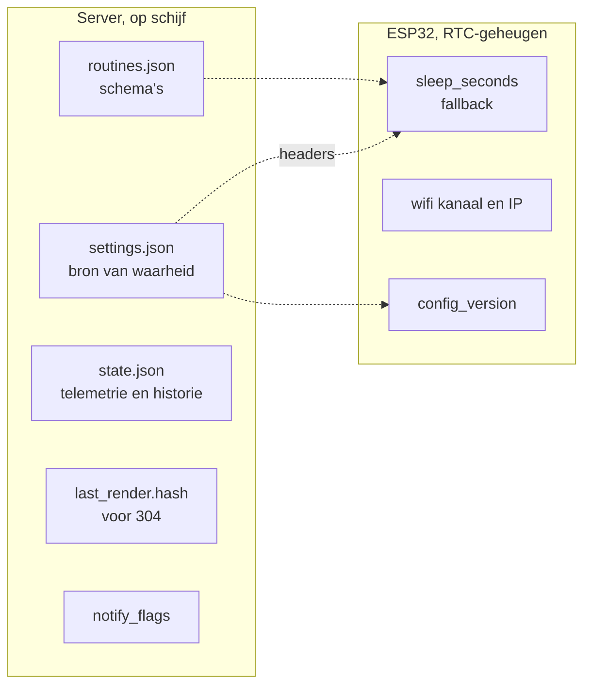
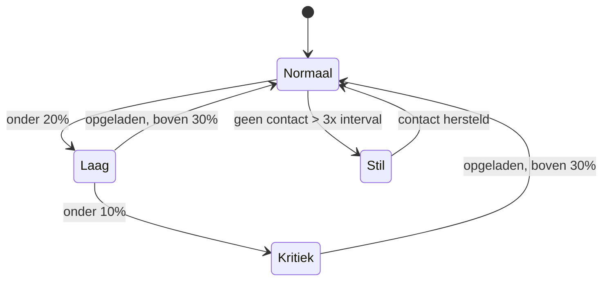
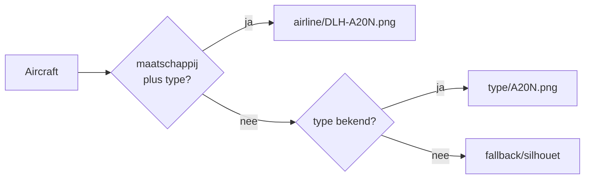

# PlaneFrame - Architectuur v2

E-ink vliegtuigtracker met illustraties. Server rendert, apparaat toont.

Gewijzigd ten opzichte van v1: 13,3 inch kleurenpaneel in plaats van 7,5 inch
zwart-wit, een aparte beeldlaag voor vliegtuigillustraties, en routines voor
energiebeheer.

---

## 1. Kernprincipe

Het apparaat is dom. Alle intelligentie zit op de server.

De ESP32 doet per wake precies drie dingen: telemetrie meesturen, een
kant-en-klaar plaatje ophalen, en instellingen terugkrijgen. Verder niets.

Dit weegt bij een kleurenpaneel zwaarder dan bij zwart-wit. Een volledige
refresh duurt hier 25 tot 35 seconden, en dat is verreweg de grootste post
in je energiebudget. Alles wat je aan de serverkant kunt doen, hoeft het
apparaat niet wakker voor te blijven.

Drie gevolgen die het hele ontwerp bepalen:

- **Elke seconde wakker kost accu.** De refresh zelf is onvermijdelijk; de
  rest niet.
- **Layout aanpassen vereist geen flash.** Je itereert op de server.
- **Instellingen wonen op de server.** Een dashboard is daardoor een
  formulier dat een bestand aanpast, geen communicatieprotocol.

---

## 2. Systeemoverzicht



---

## 3. Eén wake-cyclus



De 304-tak is bij dit paneel geen optimalisatie meer maar de belangrijkste
energiebesparing die je hebt. Een overgeslagen cyclus kost ongeveer een
vijfde van een volledige.

---

## 4. Mapstructuur

### Server

```
planeframe/
├── planeframe/
│   ├── __init__.py
│   ├── config.py           instellingen laden en valideren
│   ├── units.py            omrekenconstanten
│   ├── models.py           Aircraft-klasse
│   ├── filters.py          selecteren en sorteren
│   ├── imagery.py          illustratie opzoeken per toestel
│   ├── palette.py          6-kleuren palet en kwantisering
│   ├── render.py           afbeelding samenstellen
│   ├── schedule.py         routines, interval per moment
│   ├── state.py            telemetrie lezen en schrijven
│   ├── notify.py           meldingen en drempels
│   └── sources/
│       ├── __init__.py
│       ├── base.py
│       └── airplanes_live.py
│
├── web/
│   ├── app.py
│   └── templates/
│       ├── settings.html
│       └── routines.html
│
├── assets/
│   ├── fonts/
│   └── aircraft/
│       ├── airline/        DLH-A20N.png, RYR-B738.png
│       ├── type/           A388.png, B738.png
│       └── fallback/       silhouetten per categorie
│
├── data/
│   ├── settings.json
│   ├── routines.json
│   ├── state.json
│   ├── airlines.csv        ICAO-code naar maatschappijnaam
│   └── samples/
│
├── output/
├── tests/
├── .env
├── requirements.txt
└── main.py
```

### Firmware

```
firmware/
├── src/
│   ├── main.cpp
│   ├── power.cpp           ADC, spanning naar percentage
│   ├── net.cpp             wifi met gecachte verbindingsdata
│   └── display.cpp         Spectra 6 aansturen
├── include/
│   └── secrets.h
└── platformio.ini
```

---

## 5. Verantwoordelijkheid per module

| Module | Doet wel | Doet niet |
|---|---|---|
| `config.py` | instellingen inlezen, valideren, defaults | opslaan |
| `units.py` | omrekenconstanten | logica |
| `sources/base.py` | de interface waar elke bron aan voldoet | HTTP |
| `sources/airplanes_live.py` | HTTP, retries, rate limiting, ruwe JSON | interpreteren |
| `models.py` | Aircraft-object, afstand, richting, ontbrekende velden | filteren |
| `filters.py` | commercieel bepalen, straal, hoogte, sorteren, afkappen | tekenen |
| `imagery.py` | de beste illustratie zoeken bij een toestel | tekenen |
| `palette.py` | het 6-kleuren palet en de kwantisering | layout |
| `render.py` | layout, tekst, plaatjes plaatsen | ophalen |
| `schedule.py` | bepalen welk interval nu geldt | slapen |
| `state.py` | telemetrie persistent maken, historie | melden |
| `notify.py` | drempels bewaken, ntfy aanroepen | meten |
| `web/app.py` | routes, headers, formulieren | rekenen |
| `main.py` | de losse lus aan elkaar plakken | logica |

**De belangrijkste grenzen:**

- `sources/` is de enige plek die weet waar data vandaan komt.
- `imagery.py` weet niets van layout; het geeft een pad of een geladen
  afbeelding terug, en `render.py` bepaalt waar die komt.
- `schedule.py` beslist alleen *wat het interval is*. Het slapen zelf
  gebeurt op het apparaat.

---

## 6. Endpoints

| Route | Methode | Voor wie | Geeft |
|---|---|---|---|
| `/display.bin` | GET | ESP32 | framebuffer of 304, instellingen in headers |
| `/status.json` | GET | widget, dashboard | huidige toestand |
| `/settings` | GET / POST | dashboard | instellingen lezen en opslaan |
| `/routines` | GET / POST | dashboard | routines beheren |
| `/preview.png` | GET | jij | zelfde render, kijkbaar op je scherm |
| `/` | GET | browser | het dashboard |
| `/docs` | GET | jij | automatische testinterface van FastAPI |

### Van apparaat naar server

```
bat     accuspanning in volt
rssi    signaalsterkte
wake    timer | button | boot
fw      firmwareversie
temp    interne temperatuur
```

### Van server naar apparaat

```
X-Sleep-Seconds    hoe lang slapen tot de volgende wake
X-Config-Version   oplopend nummer
X-Force-Refresh    volledig verversen ook als het beeld gelijk is
```

### status.json

```
battery_pct, voltage, rssi, temp, last_seen, next_wake,
aircraft_count, active_routine, config_version, uptime_days
```

---

## 7. Waar staat welke toestand



De server is altijd de bron van waarheid. Het RTC-geheugen bevat kopieën
die dienen als vangnet als de server onbereikbaar is.

---

## 8. Routines en energiebeheer

Dit is de laag die bepaalt hoe vaak er ververst wordt, en daarmee direct
je accuduur.

### Het model

Een routine is een tijdvenster met een eigen interval. De server evalueert
bij elke wake welke routine nu geldt en zet het resultaat in
`X-Sleep-Seconds`.

```
routine        wanneer                       interval
---------------------------------------------------------
standaard      altijd, laagste prioriteit    10 min
nacht          23:00 tot 07:00               uit
van huis       ma-vr 08:30 tot 17:00         60 min
vakantie       datumbereik, hoogste prio     uit
```

Regels: het smalste passende venster wint. Overlappen twee routines, dan
telt de hoogste prioriteit. Past er niets, dan geldt standaard.

"Uit" is geen aparte staat maar simpelweg een lang interval, bijvoorbeeld
tot het eerstvolgende moment waarop een andere routine begint. Het apparaat
slaapt dan gewoon door en heeft geen extra logica nodig.

### Waarom dit op de server hoort

Het apparaat kent geen kalender, geen tijdzone en geen zomertijd, en je
wilt het niet opnieuw flashen omdat je op vakantie gaat. De server weet
alles al en geeft één getal terug.

Het enige waar het apparaat rekening mee moet houden: een maximum op
`X-Sleep-Seconds` als vangnet, zodat een fout in een routine je scherm
niet dagenlang laat slapen.

### Effect op de accuduur

Uitgaande van ongeveer 1,0 mAh per volledige refresh:

| Instelling | Cycli per dag | Verbruik | 10.000 mAh |
|---|---|---|---|
| 10 min, altijd | 144 | 150 mAh | ca. 8 weken |
| 10 min plus nachtpauze | 96 | 100 mAh | ca. 12 weken |
| Plus "van huis" op werkdagen | ca. 75 | 80 mAh | ca. 15 weken |
| Plus 304-besparing (30% overslaan) | ca. 75 | 62 mAh | ca. 20 weken |

De 304-logica en de routines versterken elkaar: overdag als je weg bent
verandert het beeld toch, maar hoef je het niet te zien; 's nachts verandert
het nauwelijks én kijkt niemand.

---

## 9. Meldingslogica



Twee valkuilen:

- **Vlaggen bijhouden**, anders krijg je bij elke wake dezelfde melding.
  Reset pas boven een hogere drempel dan waarop je alarmeerde.
- **De stiltebewaking moet de routine kennen.** Slaapt het apparaat volgens
  plan acht uur, dan is stilte geen storing. Gebruik het verwachte interval
  uit `schedule.py` als basis, niet een vaste drempel.

---

## 10. Beeldbibliotheek

Nieuw ten opzichte van v1, en het onderdeel waar de meeste handmatige
arbeid in gaat zitten.

### Opzoekvolgorde



- `assets/aircraft/airline/` — zijaanzicht met livery, het mooiste resultaat
- `assets/aircraft/type/` — neutraal zijaanzicht per typecode
- `assets/aircraft/fallback/` — silhouet per categorie (tweemotorig,
  viermotorig, turboprop)

### Eisen aan de bestanden

- PNG met transparante achtergrond, zodat `render.py` de achtergrondkleur
  bepaalt en niet het plaatje
- Alle toestellen dezelfde kijkrichting, anders oogt je scherm rommelig
- Op ware grootte geschaald ten opzichte van elkaar, zodat een A380 groter
  is dan een 737. Dat is precies wat je referentiebeeld doet.
- Getekend in of dicht bij je palet, zodat de kwantisering weinig hoeft te
  benaderen

### Aanpak

Begin met een generiek silhouet per categorie, zodat er altijd iets staat.
Voeg daarna maatschappijen toe op volgorde van hoe vaak ze bij jou
overkomen. Uit de eerste samples: Lufthansa, Ryanair, Eurowings, Condor,
Vueling, TAP, European Air Transport.

Tien tot vijftien maatschappijen dekken waarschijnlijk het merendeel van
wat je scherm ooit toont.

---

## 11. Renderen in kleur

### Het palet

Spectra 6 werkt met zes primaire kleuren (zwart, wit, rood, geel, blauw,
groen) en gebruikt dithering op waveform-niveau om daar tussenkleuren uit
te maken. Dat betekent dat foto's en verlopen technisch kunnen, maar dat
vlakke kleurvlakken het strakst ogen.

`palette.py` definieert de zes RGB-waarden en biedt één functie: neem een
RGB-afbeelding en geef er een gekwantiseerde versie van terug.

### Twee modi

- **Vlak** — kwantiseren zonder dithering. Harde randen, geen korrel.
  Gebruik dit voor tekst, lijnen en illustraties.
- **Gedither** — met dithering. Alleen als je ooit echte foto's toont.

Meng ze niet in één afbeelding zonder erover na te denken: dithering onder
tekst maakt die tekst slecht leesbaar.

### Formaat

1600x1200, 4 bit per pixel, ongeveer 960 KB per frame. Dat is wat er per
refresh over wifi gaat.

Overweeg om de framebuffer al op de server in het exacte formaat van het
paneel te zetten in plaats van als PNG. Dan hoeft het apparaat niets te
decoderen en scheelt dat wakkere tijd.

---

## 12. Ontwerpbeslissingen

| Beslissing | Reden | Alternatief dat afviel |
|---|---|---|
| Server rendert, apparaat toont | wakkere tijd is accu | alles op ESP32 |
| 13,3 inch in plaats van 7,3 | referentiebeeld vraagt dit formaat en die resolutie | 7,3 inch: te klein voor drie toestellen met illustratie |
| Spectra 6 | enige kleurentechniek die als los paneel te koop is en voor signage is ontworpen | Gallery 3, Kaleido 3: e-readertechniek, niet los verkrijgbaar |
| Illustraties, geen foto's | vlakke vlakken kwantiseren strak; foto's van luchten ditheren rommelig | spotterfoto's via API |
| airplanes.live als eerste bron | geen key, geen OAuth, radius-endpoint bestaat al | OpenSky: token-dans |
| Instellingen via HTTP-headers | geen tweede kanaal nodig | MQTT: extra broker |
| Routines op de server | apparaat kent geen kalender of zomertijd | schema in firmware |
| 304 bij ongewijzigd beeld | scheelt ~0,8 mAh per overgeslagen cyclus | altijd verversen |
| Automatisch verversen, geen knop | scherm moet kloppen zonder handeling | PIR of drukknop |
| ntfy voor meldingen | draait al bij je | e-mail, zelf kijken |
| FastAPI | `/docs` geeft een testinterface zonder frontend | Flask |

---

## 13. Energiebudget

Per volledige ververscyclus:

| Fase | Duur | Stroom | Kosten |
|---|---|---|---|
| Wakker worden | 1 s | 60 mA | 0,02 mAh |
| Wifi verbinden | 2 s | 130 mA | 0,07 mAh |
| Framebuffer downloaden | 3 s | 130 mA | 0,11 mAh |
| Naar paneel schrijven | 2 s | 70 mA | 0,04 mAh |
| Paneel verversen | 30 s | 95 mA | 0,79 mAh |
| **Totaal** | **38 s** | | **ca. 1,0 mAh** |

Een 304-cyclus kost alleen de eerste twee fasen plus wat overhead:
ongeveer 0,2 mAh.

Deep sleep is verwaarloosbaar zolang het board onder de 100 µA blijft.

**Onzekerheid: makkelijk 30 procent.** De refreshtijd en het verbruik
tijdens de refresh zijn de twee grootste onbekenden en verschillen per
waveform en temperatuur. Daarom is de telemetrie geen luxe: na twee weken
meten weet je je werkelijke verbruik en kun je je routines bijstellen
zonder te gokken.

---

## 14. Uitbreidingspunten

**Eigen ontvanger.** `sources/dump1090.py` naast de bestaande bron. Config
bepaalt welke actief is. De USB-dongle kan via Proxmox aan de VM worden
doorgegeven.

**Tweede scherm.** Geef elk apparaat een id mee in de querystring, dan kan
de server per apparaat een andere render en andere routines serveren.

**Aanwezigheidsdetectie.** Routines zijn nu tijdgebaseerd. Later zou je
kunnen kijken of je telefoon op het netwerk zit, en het interval daarop
aanpassen in plaats van op de klok.

**Home Assistant.** `/status.json` is al bruikbaar als sensor.

---

## 15. Bouwvolgorde

```mermaid
graph LR
    S1["1<br/>skelet"] --> S2["2<br/>API verkennen"]
    S2 --> S3["3<br/>sources"]
    S3 --> S4["4<br/>models"]
    S4 --> S5["5<br/>afstand"]
    S5 --> S6["6<br/>filters"]
    S6 --> S7["7<br/>een uur loggen"]
    S7 --> S8["8<br/>render tekst"]
    S8 --> S9["9<br/>palette"]
    S9 --> S10["10<br/>imagery"]
    S10 --> S11["11<br/>render compleet"]
    S11 --> S12["12<br/>foutafhandeling"]
    S12 --> S13["13<br/>hash en 304"]
    S13 --> S14["14<br/>FastAPI"]
    S14 --> S15["15<br/>settings en routines"]
    S15 --> S16["16<br/>state en notify"]
    S16 --> S17["17<br/>firmware"]
    S17 --> S18["18<br/>hardware"]
```



Stappen 1 tot en met 5 zijn af. Stap 7 is degene die de meeste mensen
overslaan en die je het meest oplevert: een uur lang elke minuut loggen
vertelt je hoeveel toestellen er gemiddeld zijn en hoe vaak het beeld echt
verandert. Dat bepaalt hoeveel van je cycli straks de 304-route nemen, en
dus je werkelijke accuduur.

---

## 16. Wat waar leeft, samengevat

```
Externe bron    ->  weet niets van jou
Server          ->  weet alles, beslist alles, bewaart alles
Apparaat        ->  weet alleen hoe lang het slaapt en hoe het een
                    framebuffer toont
Jij             ->  ziet alleen een melding, tenzij je iets wilt veranderen
```

Als een wijziging je dwingt om aan meer dan één van deze lagen tegelijk te
sleutelen, klopt er iets niet aan de grens ertussen.